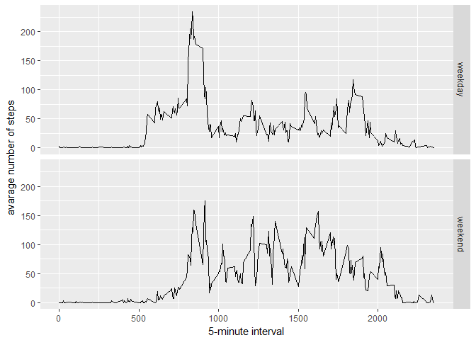

    knitr::opts_chunk$set(echo = TRUE, fig.show = "asis")

### Assignment

This assignment will be described in multiple parts. You will need to
write a report that answers the questions detailed below. Ultimately,
you will need to complete the entire assignment in a single R markdown
document that can be processed by knitr and be transformed into an HTML
file.

Throughout your report make sure you always include the code that you
used to generate the output you present. When writing code chunks in the
R markdown document, always use echo = TRUE so that someone else will be
able to read the code. This assignment will be evaluated via peer
assessment so it is essential that your peer evaluators be able to
review the code for your analysis.

For the plotting aspects of this assignment, feel free to use any
plotting system in R (i.e., base, lattice, ggplot2)

Fork/clone the GitHub repository created for this assignment. You will
submit this assignment by pushing your completed files into your forked
repository on GitHub. The assignment submission will consist of the URL
to your GitHub repository and the SHA-1 commit ID for your repository
state.

Loading and preprocessing the data Show any code that is needed to load
the data (i.e. read.csv()). Process/transform the data (if necessary)
into a format suitable for your analysis

    library("ggplot2")

    ## Warning: package 'ggplot2' was built under R version 3.2.5

    library("psych")

    ## 
    ## Attaching package: 'psych'

    ## The following objects are masked from 'package:ggplot2':
    ## 
    ##     %+%, alpha

    library("data.table")

    ## Warning: package 'data.table' was built under R version 3.2.5

    library("lubridate")

    ## Warning: package 'lubridate' was built under R version 3.2.5

    ## 
    ## Attaching package: 'lubridate'

    ## The following objects are masked from 'package:data.table':
    ## 
    ##     hour, isoweek, mday, minute, month, quarter, second, wday,
    ##     week, yday, year

    ## The following object is masked from 'package:base':
    ## 
    ##     date

    setwd("C:/Temp/Coursera/Reproducible.Research.Course.Project.1/")

#### Downloading data

#### Unziping data

    #unzip the file
    if (!file.exists("activity.csv")){
        unzip("activity.zip")
    }

#### Reading file

    #load data into table
    df <- read.csv(file = "activity.csv", header = TRUE, sep = ",")

### What is mean total number of steps taken per day?

For this part of the assignment, you can ignore the missing values in
the dataset.

#### 1. Calculate the total number of steps taken per day

    #group and sum by date
    steps.by.day <- aggregate(df$steps, by=list(df$date), FUN=sum)
    colnames(steps.by.day) <- c("date", "total.steps")
    steps.by.day

    ##          date total.steps
    ## 1  2012-10-01          NA
    ## 2  2012-10-02         126
    ## 3  2012-10-03       11352
    ## 4  2012-10-04       12116
    ## 5  2012-10-05       13294
    ## 6  2012-10-06       15420
    ## 7  2012-10-07       11015
    ## 8  2012-10-08          NA
    ## 9  2012-10-09       12811
    ## 10 2012-10-10        9900
    ## 11 2012-10-11       10304
    ## 12 2012-10-12       17382
    ## 13 2012-10-13       12426
    ## 14 2012-10-14       15098
    ## 15 2012-10-15       10139
    ## 16 2012-10-16       15084
    ## 17 2012-10-17       13452
    ## 18 2012-10-18       10056
    ## 19 2012-10-19       11829
    ## 20 2012-10-20       10395
    ## 21 2012-10-21        8821
    ## 22 2012-10-22       13460
    ## 23 2012-10-23        8918
    ## 24 2012-10-24        8355
    ## 25 2012-10-25        2492
    ## 26 2012-10-26        6778
    ## 27 2012-10-27       10119
    ## 28 2012-10-28       11458
    ## 29 2012-10-29        5018
    ## 30 2012-10-30        9819
    ## 31 2012-10-31       15414
    ## 32 2012-11-01          NA
    ## 33 2012-11-02       10600
    ## 34 2012-11-03       10571
    ## 35 2012-11-04          NA
    ## 36 2012-11-05       10439
    ## 37 2012-11-06        8334
    ## 38 2012-11-07       12883
    ## 39 2012-11-08        3219
    ## 40 2012-11-09          NA
    ## 41 2012-11-10          NA
    ## 42 2012-11-11       12608
    ## 43 2012-11-12       10765
    ## 44 2012-11-13        7336
    ## 45 2012-11-14          NA
    ## 46 2012-11-15          41
    ## 47 2012-11-16        5441
    ## 48 2012-11-17       14339
    ## 49 2012-11-18       15110
    ## 50 2012-11-19        8841
    ## 51 2012-11-20        4472
    ## 52 2012-11-21       12787
    ## 53 2012-11-22       20427
    ## 54 2012-11-23       21194
    ## 55 2012-11-24       14478
    ## 56 2012-11-25       11834
    ## 57 2012-11-26       11162
    ## 58 2012-11-27       13646
    ## 59 2012-11-28       10183
    ## 60 2012-11-29        7047
    ## 61 2012-11-30          NA

#### 2. Make a histogram of the total number of steps taken each day

    #plot histogram
    hist(steps.by.day$total.steps, main = "Total Number of Steps Taken Each Day", xlab = "Total Steps by day")

#### 3. Calculate and report the mean and median of the total number of steps taken per day

    #calculate the mean of total steps
    steps.mean <- mean(steps.by.day$total.steps, na.rm = TRUE)
    #report and report the mean of total steps;
    paste("The mean of Total Steps is", steps.mean )

    ## [1] "The mean of Total Steps is 10766.1886792453"

    #calculate and report the median of total steps
    steps.median <- median(steps.by.day$total.steps, na.rm = TRUE)
    paste("The median of Total Steps is", steps.median )

    ## [1] "The median of Total Steps is 10765"

### What is the average daily activity pattern?

#### 1. Make a time series plot (i.e. type = "l") of the 5-minute interval (x-axis) and the average number of steps taken, averaged across all days (y-axis)

    #separate data by intervals
    steps.by.interval <- aggregate(df$steps, by=list(df$interval), FUN=mean, na.rm=TRUE)
    #add column names
    colnames(steps.by.interval) <- c("interval", "mean.steps")
    #preview data
    head(steps.by.interval)

    ##   interval mean.steps
    ## 1        0  1.7169811
    ## 2        5  0.3396226
    ## 3       10  0.1320755
    ## 4       15  0.1509434
    ## 5       20  0.0754717
    ## 6       25  2.0943396

    #plot series
    plot(steps.by.interval, type ="l", main="Series of Steps",xlab="5-minute interval", ylab="Average Steps")

#### 2. Which 5-minute interval, on average across all the days in the dataset, contains the maximum number of steps?

    #find row with maximum value
    max.row <- which.max(steps.by.interval$mean.steps)
    #retrive value from row
    max.value <- steps.by.interval[max.row, ]
    max.value

    ##     interval mean.steps
    ## 104      835   206.1698

### Imputing missing values

Note that there are a number of days/intervals where there are missing
values (coded as NA). The presence of missing days may introduce bias
into some calculations or summaries of the data.

#### 1. Calculate and report the total number of missing values in the dataset (i.e. the total number of rows with NAs)

    #sum the amount of NAs values
    na.rows <- sum(is.na(df))
    na.rows

    ## [1] 2304

#### 2. Devise a strategy for filling in all of the missing values in the dataset. The strategy does not need to be sophisticated. For example, you could use the mean/median for that day, or the mean for that 5-minute interval, etc.

    #transform new data
    df2 <- df
    head(df2)

    ##   steps       date interval
    ## 1    NA 2012-10-01        0
    ## 2    NA 2012-10-01        5
    ## 3    NA 2012-10-01       10
    ## 4    NA 2012-10-01       15
    ## 5    NA 2012-10-01       20
    ## 6    NA 2012-10-01       25

#### 3. Create a new dataset that is equal to the original dataset but with the missing data filled in.

    #calculate mean and reassign for NA value
    steps.mean.global <- mean(df$steps, na.rm = TRUE)
    head(steps.mean.global)

    ## [1] 37.3826

    df2$steps[is.na(df2$steps) ] <- steps.mean.global
    head(df2)

    ##     steps       date interval
    ## 1 37.3826 2012-10-01        0
    ## 2 37.3826 2012-10-01        5
    ## 3 37.3826 2012-10-01       10
    ## 4 37.3826 2012-10-01       15
    ## 5 37.3826 2012-10-01       20
    ## 6 37.3826 2012-10-01       25

#### 4. Make a histogram of the total number of steps taken each day and Calculate and report the mean and median total number of steps taken per day. Do these values differ from the estimates from the first part of the assignment? What is the impact of imputing missing data on the estimates of the total daily number of steps?

    # Calculate the newtotal number of steps taken per day
    #group and sum by date
    new.steps.by.day <- aggregate(df2$steps, by=list(df2$date), FUN=sum)
    colnames(new.steps.by.day) <- c("date", "total.steps")
    new.steps.by.day

    ##          date total.steps
    ## 1  2012-10-01    10766.19
    ## 2  2012-10-02      126.00
    ## 3  2012-10-03    11352.00
    ## 4  2012-10-04    12116.00
    ## 5  2012-10-05    13294.00
    ## 6  2012-10-06    15420.00
    ## 7  2012-10-07    11015.00
    ## 8  2012-10-08    10766.19
    ## 9  2012-10-09    12811.00
    ## 10 2012-10-10     9900.00
    ## 11 2012-10-11    10304.00
    ## 12 2012-10-12    17382.00
    ## 13 2012-10-13    12426.00
    ## 14 2012-10-14    15098.00
    ## 15 2012-10-15    10139.00
    ## 16 2012-10-16    15084.00
    ## 17 2012-10-17    13452.00
    ## 18 2012-10-18    10056.00
    ## 19 2012-10-19    11829.00
    ## 20 2012-10-20    10395.00
    ## 21 2012-10-21     8821.00
    ## 22 2012-10-22    13460.00
    ## 23 2012-10-23     8918.00
    ## 24 2012-10-24     8355.00
    ## 25 2012-10-25     2492.00
    ## 26 2012-10-26     6778.00
    ## 27 2012-10-27    10119.00
    ## 28 2012-10-28    11458.00
    ## 29 2012-10-29     5018.00
    ## 30 2012-10-30     9819.00
    ## 31 2012-10-31    15414.00
    ## 32 2012-11-01    10766.19
    ## 33 2012-11-02    10600.00
    ## 34 2012-11-03    10571.00
    ## 35 2012-11-04    10766.19
    ## 36 2012-11-05    10439.00
    ## 37 2012-11-06     8334.00
    ## 38 2012-11-07    12883.00
    ## 39 2012-11-08     3219.00
    ## 40 2012-11-09    10766.19
    ## 41 2012-11-10    10766.19
    ## 42 2012-11-11    12608.00
    ## 43 2012-11-12    10765.00
    ## 44 2012-11-13     7336.00
    ## 45 2012-11-14    10766.19
    ## 46 2012-11-15       41.00
    ## 47 2012-11-16     5441.00
    ## 48 2012-11-17    14339.00
    ## 49 2012-11-18    15110.00
    ## 50 2012-11-19     8841.00
    ## 51 2012-11-20     4472.00
    ## 52 2012-11-21    12787.00
    ## 53 2012-11-22    20427.00
    ## 54 2012-11-23    21194.00
    ## 55 2012-11-24    14478.00
    ## 56 2012-11-25    11834.00
    ## 57 2012-11-26    11162.00
    ## 58 2012-11-27    13646.00
    ## 59 2012-11-28    10183.00
    ## 60 2012-11-29     7047.00
    ## 61 2012-11-30    10766.19

plot histogram
==============

     hist(new.steps.by.day$total.steps, main = "Total Number of Steps Taken Each Day Without NAs", xlab = "Total Steps by day")

    #calculate the mean of total steps
    new.steps.mean <- mean(new.steps.by.day$total.steps, na.rm = TRUE)
    #report and report the mean of total steps;
    paste("The new mean of Total Steps is", new.steps.mean)

    ## [1] "The new mean of Total Steps is 10766.1886792453"

    #calculate the median of total steps
    new.steps.median <- median(new.steps.by.day$total.steps, na.rm = TRUE)
    #report and report the median of total steps;
    paste("The new median of Total Steps is", new.steps.median)

    ## [1] "The new median of Total Steps is 10766.1886792453"

The values do not differ from from the estimates from the first part of
the assignment. There is a slightly difference for the median, but not a
significant impact.

### Are there differences in activity patterns between weekdays and weekends?

For this part the weekdays() function may be of some help here. Use the
dataset with the filled-in missing values for this part.

#### 1. Create a new factor variable in the dataset with two levels - "weekday" and "weekend" indicating whether a given date is a weekday or weekend day.

    df$week <- ifelse(weekdays(as.Date(df$date)) %in% c("Saturday", "Sunday"), "weekend", "weekday")
    head(df)

    ##   steps       date interval    week
    ## 1    NA 2012-10-01        0 weekday
    ## 2    NA 2012-10-01        5 weekday
    ## 3    NA 2012-10-01       10 weekday
    ## 4    NA 2012-10-01       15 weekday
    ## 5    NA 2012-10-01       20 weekday
    ## 6    NA 2012-10-01       25 weekday

    table(df$week)

    ## 
    ## weekday weekend 
    ##   12960    4608

#### 2. Make a panel plot containing a time series plot (i.e. type = "l") of the 5-minute interval (x-axis) and the average number of steps taken, averaged across all weekday days or weekend days (y-axis). See the README file in the GitHub repository to see an example of what this plot should look like using simulated data.

    #separate data by intervals
    steps.by.interval.by.week <- aggregate(steps ~ interval + week, data = df, FUN=mean, na.rm=TRUE)
    head(steps.by.interval.by.week)

    ##   interval    week     steps
    ## 1        0 weekday 2.3333333
    ## 2        5 weekday 0.4615385
    ## 3       10 weekday 0.1794872
    ## 4       15 weekday 0.2051282
    ## 5       20 weekday 0.1025641
    ## 6       25 weekday 1.5128205

    #preview data
    head(steps.by.interval.by.week)

    ##   interval    week     steps
    ## 1        0 weekday 2.3333333
    ## 2        5 weekday 0.4615385
    ## 3       10 weekday 0.1794872
    ## 4       15 weekday 0.2051282
    ## 5       20 weekday 0.1025641
    ## 6       25 weekday 1.5128205

    #plot series
    ggplot(steps.by.interval.by.week, aes(interval, steps)) + geom_line() + facet_grid(week ~ .) + xlab("5-minute interval") + ylab("avarage number of steps")

